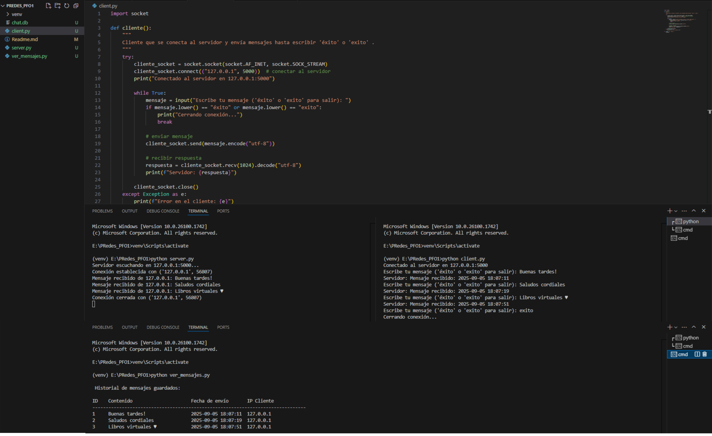

# PFO1-Programación sobre Redes

## Implementación de un Chat Básico Cliente-Servidor con Sockets y Base de Datos

## Objetivo:
Aprender a configurar un servidor de sockets en Python que reciba mensajes de clientes,
los almacene en una base de datos y envíe confirmaciones, aplicando buenas prácticas de
modularización y manejo de errores.
Utilizar los comentarios para explicar tus configuraciones en el servidor.

## Estructura
- `server.py`: Inicializa el socket servidor, recibe mensajes de clientes y guarda los mensajes en SQLite.
- `client.py`: El usuario puede enviar mensajes al servidor hasta que escriba éxito o exito para terminar.
- `ver_mensajes.py`: Permite visualizar los mensajes que se guardan en la base de datos.

## Instrucciones

1. Clonar el repositorio:
   ```bash
   git clone https://github.com/Pro-Piki/PRedes_PFO1.git
   ```

2. Ejecutar el servidor:
   ```bash
   python server.py
   ```

3. En otra terminal, ejecutar el cliente:
   ```bash
   python client.py
   ```

4. Escribir mensajes en el cliente. Para terminar, escribir `éxito` o `exito`.

5. En otra terminal, ejecutar la visualización de mensajes:
   ```bash
   python ver_mensajes.py
   ```

## Captura
